# Fragebogen-Ablaufdiagramm

## Gesamtübersicht

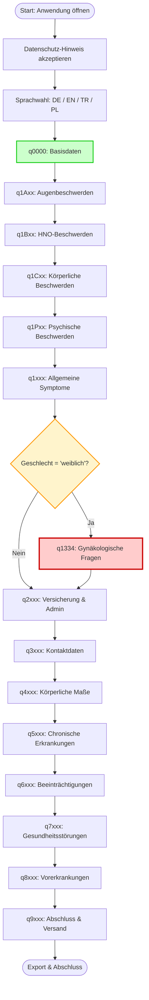

## Detaillierter Ablauf: Basisdaten (q0000)

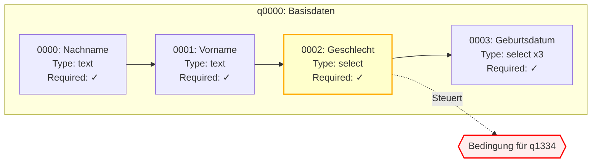

## Bedingte Verzweigung: Geschlechtsspezifische Fragen

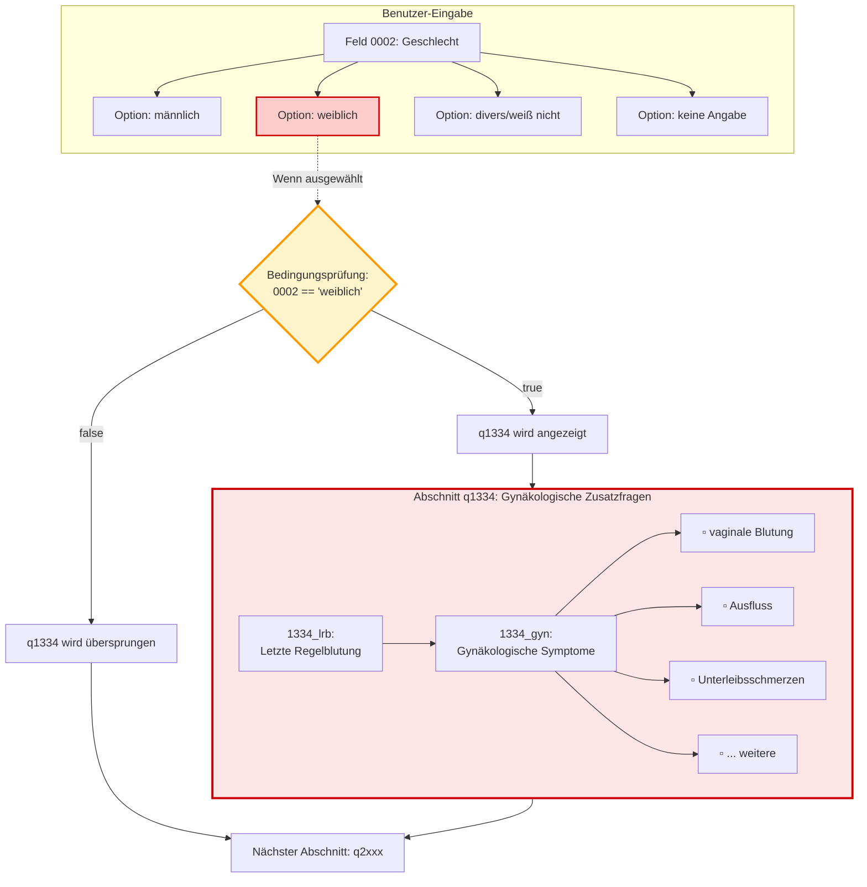

## Kategorisierung der 223 Abschnitte

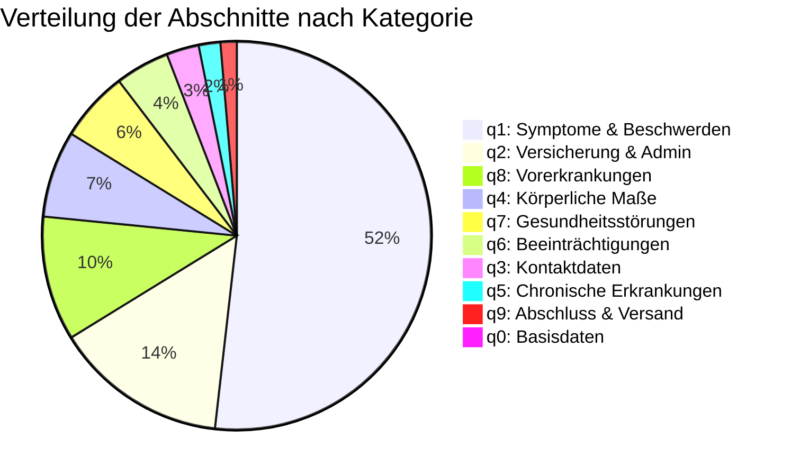

## Feldtypen-Verteilung

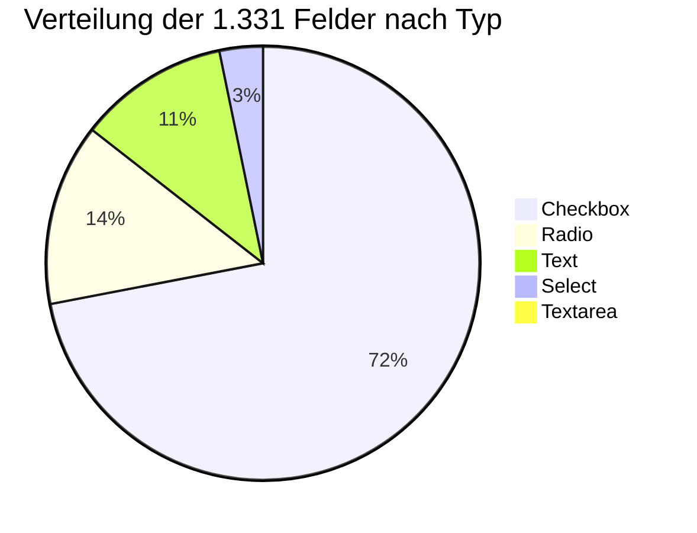

## Bedingungslogik-Implementierung

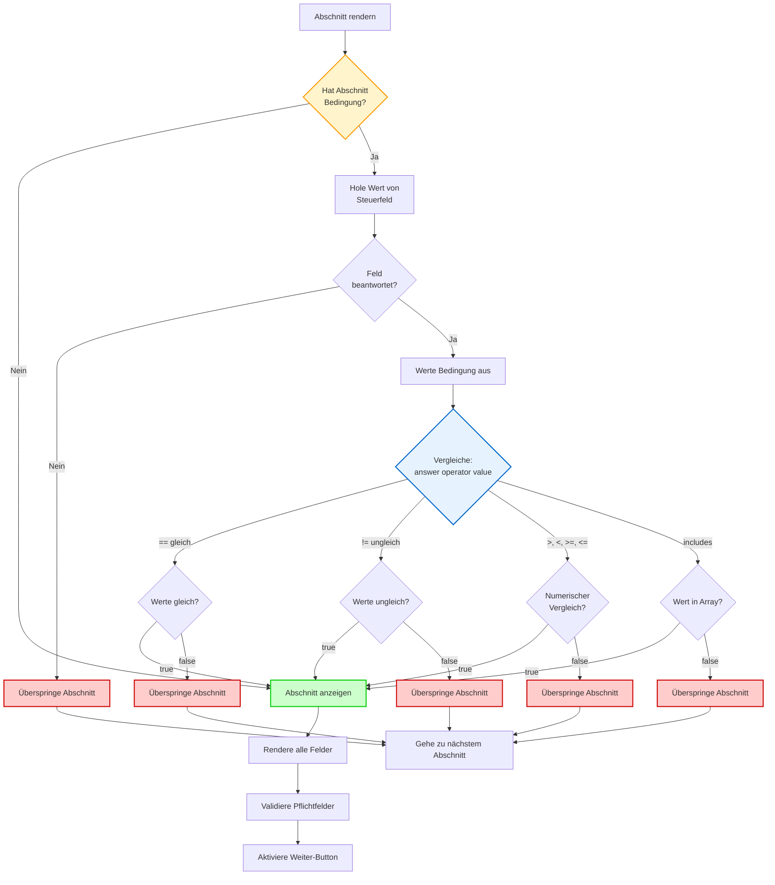

## Datenverwaltung und Export

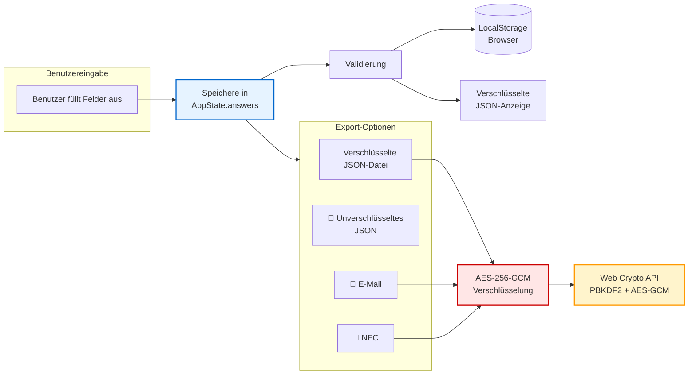

## Verschlüsselungs-Pipeline (PR #3 Änderung)

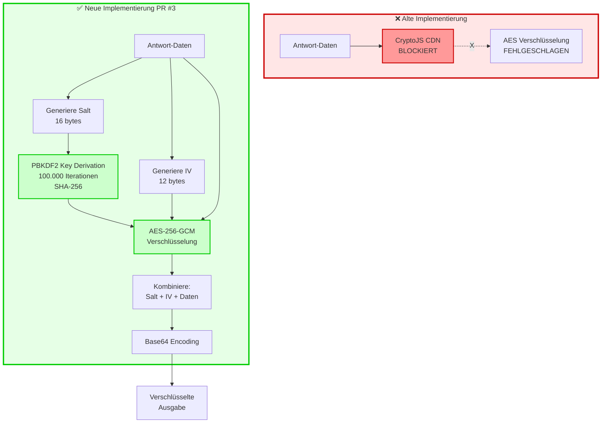

## Abhängigkeitsgraph

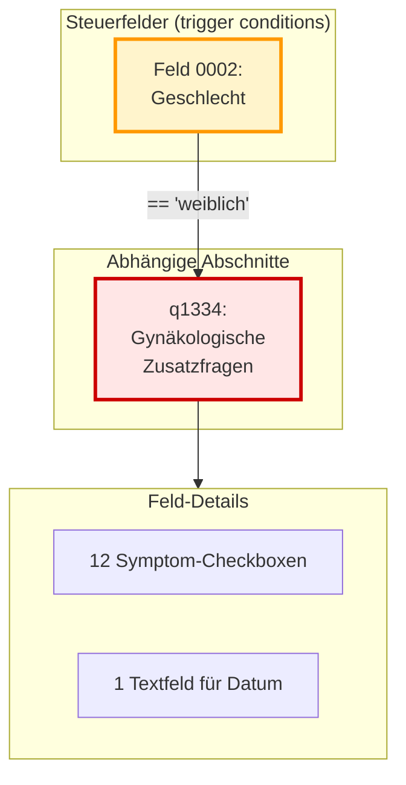

## Navigation und Validierung

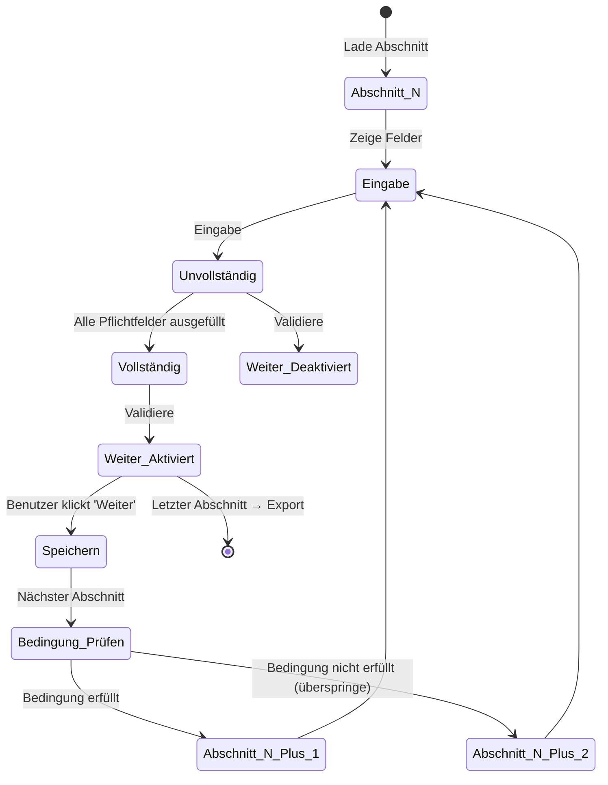

## Erweiterbarkeit: Neue Bedingungen hinzufügen

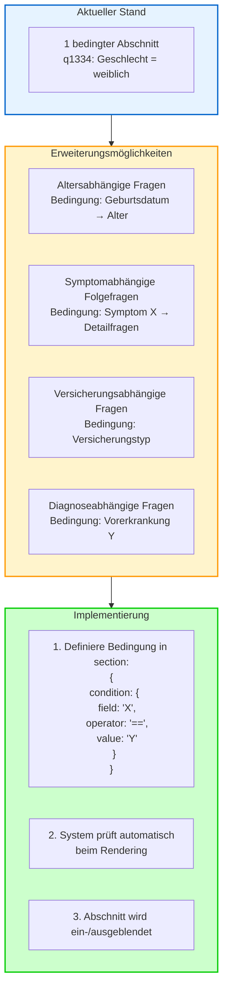

## Zusammenfassung: System-Architektur

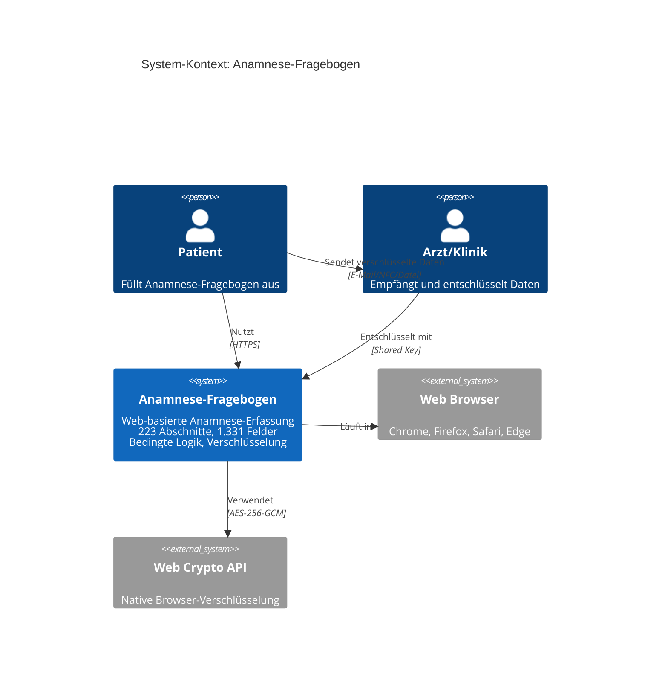

---

**Hinweise zur Darstellung:**
- Diese Diagramme verwenden Mermaid-Syntax und werden auf GitHub automatisch gerendert
- Die Diagramme zeigen den Ablauf, die Bedingungen und die Datenflüsse im Fragebogen
- Rote Farben kennzeichnen bedingte Elemente
- Grüne Farben zeigen erfolgreiche Pfade
- Gelbe Farben markieren Entscheidungspunkte
