# Fragebogen-Ablaufdiagramm

## Gesamtübersicht


## Detaillierter Ablauf: Basisdaten (q0000)


## Bedingte Verzweigung: Geschlechtsspezifische Fragen

```mermaid
flowchart TD
    subgraph Input["Benutzer-Eingabe"]
        Gender[Feld 0002: Geschlecht]
        Opt1[Option: männlich]
        Opt2[Option: weiblich]
        Opt3[Option: divers/weiß nicht]
        Opt4[Option: keine Angabe]
        
        Gender --> Opt1
        Gender --> Opt2
        Gender --> Opt3
        Gender --> Opt4
    end
    
    Opt2 -.Wenn ausgewählt.-> Check{Bedingungsprüfung:<br/>0002 == 'weiblich'}
    Check -->|true| Show[q1334 wird angezeigt]
    Check -->|false| Skip[q1334 wird übersprungen]
    
    Show --> Q1334
    Skip --> Next[Nächster Abschnitt: q2xxx]
    Q1334 --> Next
    
    subgraph Q1334["Abschnitt q1334: Gynäkologische Zusatzfragen"]
        F1[1334_lrb:<br/>Letzte Regelblutung]
        F2[1334_gyn:<br/>Gynäkologische Symptome]
        F2a[▫️ vaginale Blutung]
        F2b[▫️ Ausfluss]
        F2c[▫️ Unterleibsschmerzen]
        F2d[▫️ ... weitere]
        
        F1 --> F2
        F2 --> F2a
        F2 --> F2b
        F2 --> F2c
        F2 --> F2d
    end
    
    style Opt2 fill:#ffcccc,stroke:#cc0000,stroke-width:2px
    style Check fill:#fff4cc,stroke:#ff9900,stroke-width:3px
    style Q1334 fill:#ffe6e6,stroke:#cc0000,stroke-width:3px
```



## Kategorisierung der 223 Abschnitte


## Feldtypen-Verteilung


## Bedingungslogik-Implementierung

```mermaid
flowchart TD
    Start[Abschnitt rendern] --> HasCond{Hat Abschnitt<br/>Bedingung?}
    
    HasCond -->|Nein| Render[Abschnitt anzeigen]
    HasCond -->|Ja| GetField[Hole Wert von<br/>Steuerfeld]
    
    GetField --> Answered{Feld<br/>beantwortet?}
    Answered -->|Nein| Skip1[Überspringe Abschnitt]
    Answered -->|Ja| Evaluate[Werte Bedingung aus]
    
    Evaluate --> Compare{Vergleiche:<br/>answer operator value}
    
    Compare -->|== gleich| CheckEq{Werte gleich?}
    Compare -->|!= ungleich| CheckNeq{Werte ungleich?}
    Compare -->|>, <, >=, <=| CheckNum{Numerischer<br/>Vergleich?}
    Compare -->|includes| CheckArr{Wert in Array?}
    
    CheckEq -->|true| Render
    CheckEq -->|false| Skip2[Überspringe Abschnitt]
    
    CheckNeq -->|true| Render
    CheckNeq -->|false| Skip3[Überspringe Abschnitt]
    
    CheckNum -->|true| Render
    CheckNum -->|false| Skip4[Überspringe Abschnitt]
    
    CheckArr -->|true| Render
    CheckArr -->|false| Skip5[Überspringe Abschnitt]
    
    Render --> RenderFields[Rendere alle Felder]
    RenderFields --> Validate[Validiere Pflichtfelder]
    Validate --> EnableNext[Aktiviere Weiter-Button]
    
    Skip1 --> NextSection[Gehe zu nächstem Abschnitt]
    Skip2 --> NextSection
    Skip3 --> NextSection
    Skip4 --> NextSection
    Skip5 --> NextSection
    
    style HasCond fill:#fff4cc,stroke:#ff9900,stroke-width:2px
    style Compare fill:#e6f3ff,stroke:#0066cc,stroke-width:2px
    style Render fill:#ccffcc,stroke:#00cc00,stroke-width:2px
    style Skip1 fill:#ffcccc,stroke:#cc0000,stroke-width:2px
    style Skip2 fill:#ffcccc,stroke:#cc0000,stroke-width:2px
    style Skip3 fill:#ffcccc,stroke:#cc0000,stroke-width:2px
    style Skip4 fill:#ffcccc,stroke:#cc0000,stroke-width:2px
    style Skip5 fill:#ffcccc,stroke:#cc0000,stroke-width:2px
```



## Datenverwaltung und Export

```mermaid
flowchart LR
    subgraph Input["Benutzereingabe"]
        User[Benutzer füllt Felder aus]
    end
    
    User --> Store[Speichere in<br/>AppState.answers]
    Store --> Validate[Validierung]
    
    Validate --> LocalStorage[(LocalStorage<br/>Browser)]
    Validate --> JSONBox[Verschlüsselte<br/>JSON-Anzeige]
    
    subgraph Export["Export-Optionen"]
        E1[📄 Verschlüsselte<br/>JSON-Datei]
        E2[📄 Unverschlüsseltes<br/>JSON]
        E3[📧 E-Mail]
        E4[📱 NFC]
    end
    
    Store --> Export
    
    E1 --> Encrypt[AES-256-GCM<br/>Verschlüsselung]
    E3 --> Encrypt
    E4 --> Encrypt
    
    Encrypt --> WebCrypto[Web Crypto API<br/>PBKDF2 + AES-GCM]
    
    style Store fill:#e6f3ff,stroke:#0066cc,stroke-width:2px
    style Encrypt fill:#ffe6e6,stroke:#cc0000,stroke-width:2px
    style WebCrypto fill:#fff4cc,stroke:#ff9900,stroke-width:2px
```



## Verschlüsselungs-Pipeline (PR #3 Änderung)


## Abhängigkeitsgraph

```mermaid
graph TD
    subgraph Steuerfelder["Steuerfelder (trigger conditions)"]
        F0002[Feld 0002:<br/>Geschlecht]
    end
    
    subgraph Abhängige_Abschnitte["Abhängige Abschnitte"]
        Q1334[q1334:<br/>Gynäkologische<br/>Zusatzfragen]
    end
    
    F0002 -->|"== 'weiblich'"| Q1334
    
    subgraph Details["Feld-Details"]
        D1[12 Symptom-Checkboxen]
        D2[1 Textfeld für Datum]
    end
    
    Q1334 --> Details
    
    style F0002 fill:#fff4cc,stroke:#ff9900,stroke-width:3px
    style Q1334 fill:#ffe6e6,stroke:#cc0000,stroke-width:3px
```

## Navigation und Validierung

```mermaid
stateDiagram-v2
    [*] --> Abschnitt_N: Lade Abschnitt
    
    Abschnitt_N --> Eingabe: Zeige Felder
    Eingabe --> Unvollständig: Eingabe
    Unvollständig --> Vollständig: Alle Pflichtfelder ausgefüllt
    
    Unvollständig --> Weiter_Deaktiviert: Validiere
    Vollständig --> Weiter_Aktiviert: Validiere
    
    Weiter_Aktiviert --> Speichern: Benutzer klickt 'Weiter'
    Speichern --> Bedingung_Prüfen: Nächster Abschnitt
    
    Bedingung_Prüfen --> Abschnitt_N_Plus_1: Bedingung erfüllt
    Bedingung_Prüfen --> Abschnitt_N_Plus_2: Bedingung nicht erfüllt (überspringe)
    
    Abschnitt_N_Plus_1 --> Eingabe
    Abschnitt_N_Plus_2 --> Eingabe
    
    Weiter_Aktiviert --> [*]: Letzter Abschnitt → Export
```



## Erweiterbarkeit: Neue Bedingungen hinzufügen

```mermaid
flowchart TD
    subgraph Current["Aktueller Stand"]
        C1[1 bedingter Abschnitt<br/>q1334: Geschlecht = weiblich]
    end
    
    subgraph Potential["Erweiterungsmöglichkeiten"]
        P1[Altersabhängige Fragen<br/>Bedingung: Geburtsdatum → Alter]
        P2[Symptomabhängige Folgefragen<br/>Bedingung: Symptom X → Detailfragen]
        P3[Versicherungsabhängige Fragen<br/>Bedingung: Versicherungstyp]
        P4[Diagnoseabhängige Fragen<br/>Bedingung: Vorerkrankung Y]
    end
    
    Current --> Potential
    
    subgraph Implementation["Implementierung"]
        I1["1. Definiere Bedingung in section:<br/>{<br/>  condition: {<br/>    field: 'X',<br/>    operator: '==',<br/>    value: 'Y'<br/>  }<br/>}"]
        I2["2. System prüft automatisch<br/>beim Rendering"]
        I3["3. Abschnitt wird ein-/ausgeblendet"]
    end
    
    Potential --> Implementation
    
    style Current fill:#e6f3ff,stroke:#0066cc,stroke-width:2px
    style Potential fill:#fff4cc,stroke:#ff9900,stroke-width:2px
    style Implementation fill:#ccffcc,stroke:#00cc00,stroke-width:2px
```



## Zusammenfassung: System-Architektur

```mermaid
C4Context
    title System-Kontext: Anamnese-Fragebogen
    
    Person(patient, "Patient", "Füllt Anamnese-Fragebogen aus")
    Person(doctor, "Arzt/Klinik", "Empfängt und entschlüsselt Daten")
    
    System(anamnese, "Anamnese-Fragebogen", "Web-basierte Anamnese-Erfassung<br/>223 Abschnitte, 1.331 Felder<br/>Bedingte Logik, Verschlüsselung")
    
    System_Ext(browser, "Web Browser", "Chrome, Firefox, Safari, Edge")
    System_Ext(crypto, "Web Crypto API", "Native Browser-Verschlüsselung")
    
    Rel(patient, anamnese, "Nutzt", "HTTPS")
    Rel(anamnese, browser, "Läuft in")
    Rel(anamnese, crypto, "Verwendet", "AES-256-GCM")
    Rel(patient, doctor, "Sendet verschlüsselte Daten", "E-Mail/NFC/Datei")
    Rel(doctor, anamnese, "Entschlüsselt mit", "Shared Key")
```



---

**Hinweise zur Darstellung:**
- Diese Diagramme verwenden Mermaid-Syntax und werden auf GitHub automatisch gerendert
- Die Diagramme zeigen den Ablauf, die Bedingungen und die Datenflüsse im Fragebogen
- Rote Farben kennzeichnen bedingte Elemente
- Grüne Farben zeigen erfolgreiche Pfade
- Gelbe Farben markieren Entscheidungspunkte
